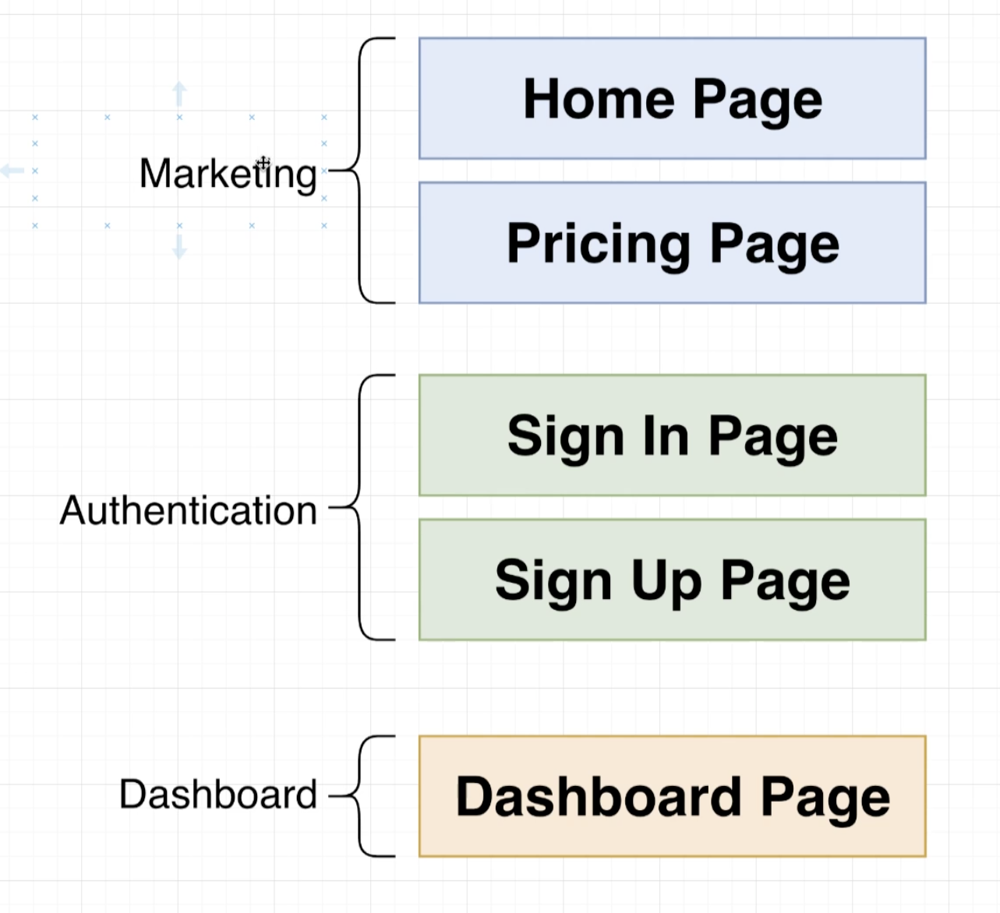
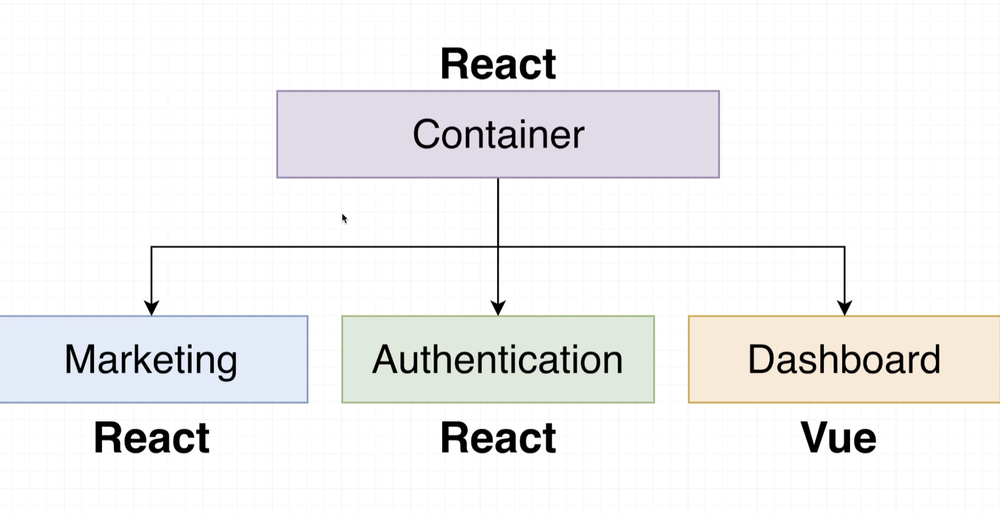

# Microfrontend SaaS App Landing Page, Authentication and Dashboard

A demo microfrontend SaaS app landing page, authentication and dashboard built with React, Vue and Webpack Module Federation using Run-Time Integration. Deployment will be handled using Travis CI for CI/CD, and AWS S3 as the host.

NOTE: there is no backend or state for this app; it is just a demo of how to use microfrontends

### Install

Run the following command in both the auth, marketing, dashboard and container folders:

    $ npm install

### Run

Run the following command in both the auth, marketing, dashboard and container folders:

    $ npm start

Container: http://localhost:8080/

## Microfrontends

### What are microfrontends?

- Divide a monolithic app into multiple, smaller apps
- Each smaller app is responsible for a distinct feature of the product

### Why use them?

- Multiple engineering teams can work in isolation
- Each smaller app is easier to understand and make changes to

### Requirement

Must be able to develop each sub-project in isolation, and run each sub-project in the context of a container.

## Project Specs

### Dividing Project into Separate Apps

### Frameworks For Each App

## Project Requirements

### Requirement #1 - Zero coupling between child apps

- No importing of functions/objects/classes/etc.
- No shared state
- Shared libraries through Module Federation is OK

### Requirement #2 - Near-zero coupling between container and child apps

- Container shouldn't assume that a child is using a particular framework
- Any necessary communication done with callbacks or simple events

### Requirement #3 - CSS Scoping

- CSS from one project shouldn't affect another

### Requirement #4 - Version control (monorepo vs separate) shouldn't have any impact on the overall project

- Some people want to use monorepos
- Some people want to keep everything in a separate repo

### Requirement #5 - Container should be able to decide to always use the latest version of a microfrontend OR specify a specific version

- Container will always use the latest version of a child app (doesn't require a redeploy of containter)
- OR Container can specify exactly which version of a child it wants to use (requires a redeploy to change)

## Deployment Requirements

- Want to deploy each microfrontend independently (including the container)
- Location of child app remoteEntry.js files must be known at build time!
- Many frontend deployment solutions assume you're deploying a single project - we need something that can handle multiple different ones
- Probably need a CI/CD pipeline of some sort
- At present, the remoteEntry.js file name is fixed! Need to think about caching issues
